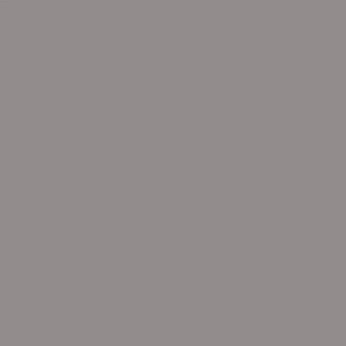
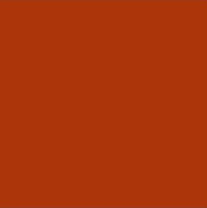
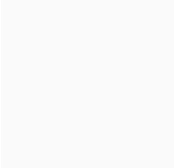

# Beefs & Babe Gym

 ## About BB Gym

Beefs & Babe Gym (BB Gym) website is for users to locate and get a 'feel' for the gym. 
New and frequent visiotrs can find information and contact / location details of the gym with ease.
The site will show the space, some equipment and give a friendly atmosphere with emphasis on 'serious training'.

The website can be accessed via this [link](https://hewers89.github.io/BB_Gym/)

## User Stories /  Goals

### First Time Visitor Goals:
* As a first time visitor I would want to see with ease what the websites purpose is. In this instance, showing a gym with title and highlighting it is a gym.

* Additionally, I need to easily navigate my way around the website to access the details i need. Access to social media and contact details.

* Furthermore, I would want the site to show the organisation is trustworthly and worth visiting for a membership.

### Returning Visitor Goals

* As a returning visitor i would want to have access to the gym contact details.

* I may want to see if i have been showcased in the show room photography.

* Also have access to additional information about the organisation through their socials.

### Company Goals.

* For new visitors to contact the organisation and sign up for a membership.

* For new/current members to access and sign up to classes.

* For new/current members to access and sign up to PT sessions. 

## Features

Navigation
The NavBar is situated at the top of the screen.
The BB is the link to the home page. 
Showroom links to pictures of the gm enviroment 
Contact links to Address in text form and google maps. Also a contact us form. 

It has a simple design and is easy to use, the links have hover effect and change color. 

The Navbar is responsive and adjusts to fit the screen.

## Footer

The footer contains all social media links for the gym which open in a new tab.

## Home Page
The home page has a simpke design with a main hero image. 
It is clean and enhances that this is a gym webpage.

## Show Room
The show room has pictures showing equipment and the public exercising, with and without PT. 
Its highlights the friendly enviroment and welcomes potential members to visit.

## Contact

The contact page has simple layout easy to use for contact in person by visiting or via a contact form complete with submit button.

## Classes

This page shows the current gym schedule in an easy to read layout.

## Design

### Colour scheme

* Black was used with the opacity of 0.8 in footers and nav bar.
* Orange/red was used throughout due to being gender neutral and clean against the background. It is also used on the BB 'logo' to help it stand out.
* Off white was used for links. 
* Grey is a neutral balance between the red black and off white. 

## Wireframes

[Homepage Laptop](documentation/wireframes/homescreen_laptop.png)

[Homepage ipad | phone](documentation/wireframes/homescreen.png)

[Showroom Laptop](documentation/wireframes/showroom_laptop.png)

[Showroom ipad | phone](documentation/wireframes/showroom.png)

[Contact Laptop](documentation/wireframes/contact_laptop.png)

[Contact ipad | phone](documentation/wireframes/contact.png)

## Deployment

The site was deployed to GitHub.

Follow the steps to deploy:

* In the Github repository, open the settings tab
* From the drop-dowm menu, selct **Main** branch and then **Save**

## Local Deployment
To make a local copy of this project, you can clone it. In your IDE, type the following command:
git clone https://github.com/HEWERS89/BB_Gym.git

## Languages
 [HTML](https://www.w3schools.com/html/) for the foundation of the site.

 [CSS](https://developer.mozilla.org/en-US/docs/Web/CSS) used to add style and layout.

 [Flexbox](https://developer.mozilla.org/en-US/docs/Learn/CSS/CSS_layout/Flexbox) to arrange items and make them responsive.

 [Balsamiq](https://balsamiq.com/) used to make wireframes.

 [VScode](https://code.visualstudio.com/) used as my tool for writing and editing code.

 [Github](https://github.com/) used to host the code of the website.

 [Gitpod](https://www.gitpod.io/) an open source CDE

## Media

 #### Gym Images
 
 [Hero](https://jonathanholmes.co.uk/6-of-the-best-gyms-in-london/) Hand holding barbell 

 [Gym Equipment](https://www.cgtrader.com/) Treadmills and spin bikes in gym with orange and black theme

 [Gym Theory](https://pinnaclecontracting.com/)

 [Gym Racked](https://ny.racked.com/) Group of women during an exercise class

 [Weights](https://fitness-superstore.co.uk/weights) Barbells on stand within an orange gym

 [Orange Gym](https://orangegym.at) Man on treadmill in gym with orange and black gym

 [Exercise](https://\Fitness-superstore.co.uk) Man exercising using gym equipment 

 [Trainer](https://growthopsdigital.com.au) Woman exercising with a personal trainer

 [Pt 1](https://mygym.co.uk) Personal trainer smilling with people exercising in background

 [Pt](https://nacams.org) Woman deadlifting with personal trainer

 ## Credits

 [Code](https://www.w3schools.com)

 [Flex box Kevin powell](https://www.youtube.com/watch?v=vQAvjof1oe4)

 [Bootstrap](https://getbootstrap.com/)

 [Fontawsome](https://fontawesome.com/)

 [Map](https://www.google.com/maps) 

 [Color Palette generator](https://convertingcolors.com/)

 ## Acknowledgments 

[Code institute](https://learn.codeinstitute.net/) Mentor Juliia Konovalova 